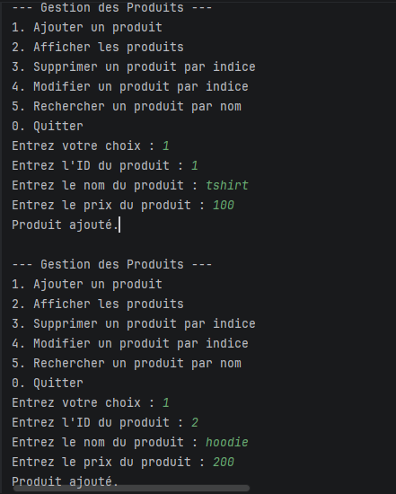
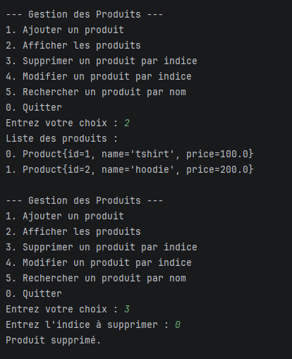
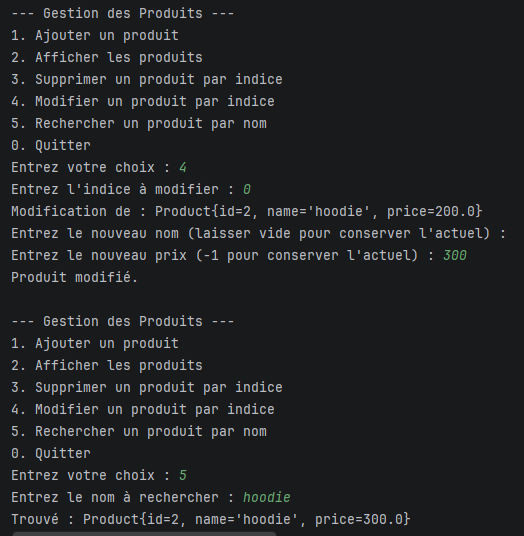
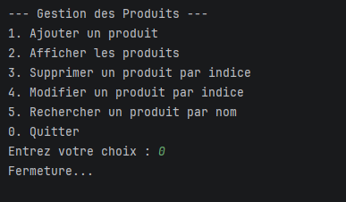
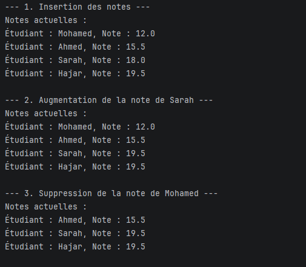
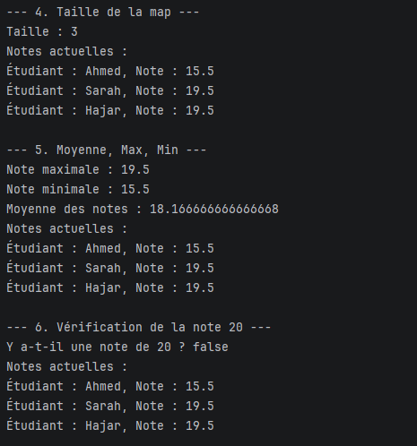
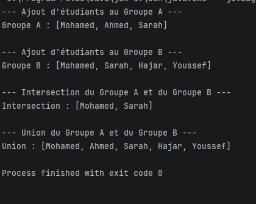
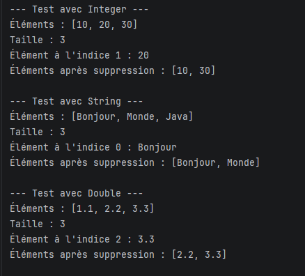
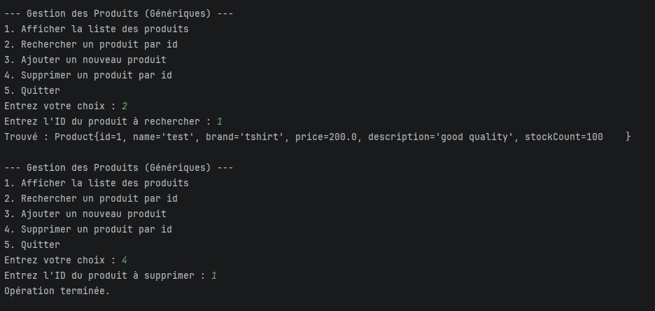
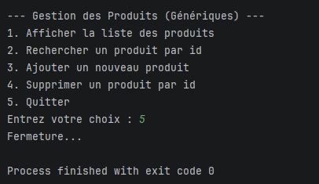

# TP 2 : Collections & Généricité en Java

Ce projet contient les solutions aux exercices pratiques sur les Collections (Listes, Maps, Sets) et la Généricité en Java.

## Structure du Projet

Le code source est organisé comme suit dans le dossier `src` :

*   **Partie 1 : Collections**
    *   `src/part1/lists` : Gestion de produits avec `ArrayList`.
    *   `src/part1/maps` : Gestion de notes d'étudiants avec `HashMap`.
    *   `src/part1/sets` : Gestion de groupes d'étudiants avec `HashSet`.
*   **Partie 2 : Généricité**
    *   `src/part2/generics` : Classe de stockage générique `GenericStorage`.
    *   `src/part2/products` : Interface générique `IMetier` appliquée aux produits.

---

## Partie I : Collections

### 1. Listes (Gestion des Produits)
Une application console pour gérer une liste de produits. Elle permet d'ajouter, supprimer, modifier, afficher et rechercher des produits.

**Fonctionnalités :**
*   Ajout de produit.
*   Suppression par index.
*   Affichage de la liste.
*   Modification par index.
*   Recherche par nom.

**Exécution :**

*Menu principal et ajout d'un produit.*


*Affichage de la liste et recherche d'un produit.*


*Modification d'un produit existant.*


*Suppression d'un produit.*

---

### 2. Maps (Gestion des Notes)
Utilisation d'une `HashMap` pour stocker et manipuler les notes des étudiants.

**Opérations :**
*   Insertion, augmentation et suppression de notes.
*   Calculs statistiques (Moyenne, Max, Min).
*   Utilisation de lambdas pour l'affichage.

**Exécution :**

*Insertion, augmentation et suppression.*


*Calcul de la moyenne, max, min et vérification de note.*

---

### 3. Sets (Gestion des Groupes)
Utilisation de `HashSet` pour gérer deux groupes d'étudiants et effectuer des opérations ensemblistes.

**Opérations :**
*   Union de deux groupes.
*   Intersection de deux groupes.

**Exécution :**

*Affichage des groupes, de leur intersection et de leur union.*

---

## Partie II : Généricité

### 1. Stockage Générique (`GenericStorage`)
Une classe générique capable de stocker, ajouter, récupérer et supprimer des éléments de n'importe quel type (`Integer`, `String`, `Double`, etc.).

**Exécution :**

*Tests avec des entiers, des chaînes de caractères et des doubles.*

---

### 2. Interface Générique (`IMetier<T>`)
Application de la généricité à une interface métier pour la gestion des produits.

**Structure :**
*   `IMetier<T>` : Interface générique (Add, GetAll, FindById, Delete).
*   `MetierProduitImpl` : Implémentation pour la classe `Product`.

**Exécution :**

*Menu de l'application générique et affichage.*


*Recherche d'un produit par ID.*


*Suppression d'un produit.*

---

## Comment exécuter le projet

Ce projet est configuré pour **IntelliJ IDEA**.

1.  Ouvrez le dossier du projet dans IntelliJ.
2.  Assurez-vous que le dossier `src` est marqué comme **Sources Root**.
3.  Ouvrez la classe contenant la méthode `main` que vous souhaitez exécuter (par exemple `ProductManagementApp.java`).
4.  Cliquez sur le bouton **Run** (flèche verte) à côté de la méthode main.

**En ligne de commande :**
Compilez d'abord le projet, puis exécutez la classe souhaitée en spécifiant le classpath et l'encodage UTF-8.

```bash
# Compilation
javac -d bin src/part1/lists/*.java src/part1/maps/*.java src/part1/sets/*.java src/part2/generics/*.java src/part2/products/*.java

# Exécution (exemple)
java -Dfile.encoding=UTF-8 -cp bin part1.lists.ProductManagementApp
```
